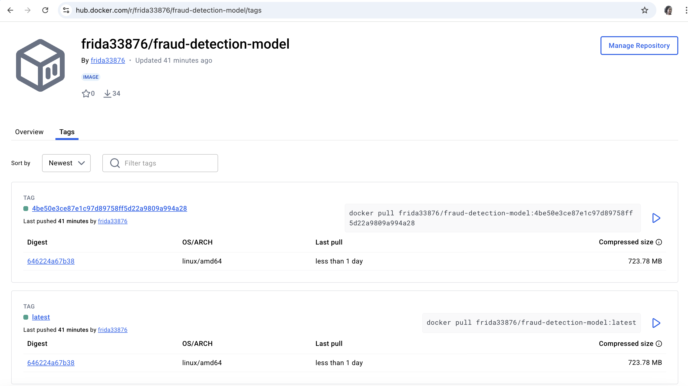
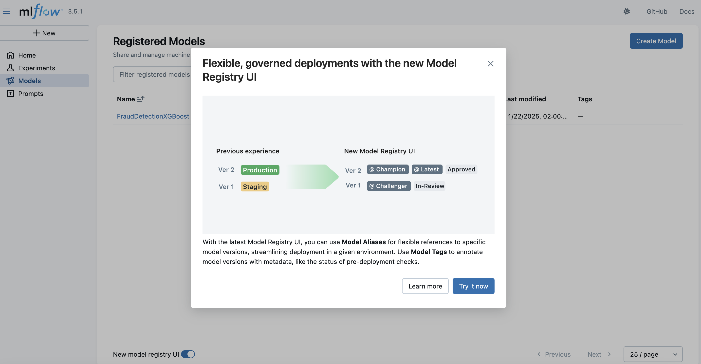
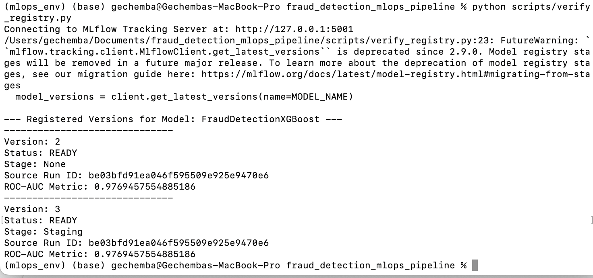

# Fraud Detection MLOps Pipeline
Airflow, MLflow, Docker, FastAPI, Github Actions, pytest

A production-ready fraud detection system demonstrating end-to-end MLOps practices including model training, experiment tracking, orchestration, and deployment on AWS.

# Project Overview

This project implements a complete machine learning operations (MLOps) pipeline for fraud detection using XGBoost. It showcases:

- **Automated ML Pipeline**: Orchestrated with Apache Airflow
- **Experiment Tracking**: MLflow for model versioning and metrics
- **Model Serving**: FastAPI REST API for real-time predictions
- **Cloud Deployment**: AWS EC2 with cost-optimized architecture 
- **CI/CD**: GitHub Actions for automated testing and deployment
- **Containerization**: Docker for reproducible environments


## Docker Image



### Architecture

```
┌─────────────────────────────────────────────────────────────┐
│ Development (Local)                                          │
│  ├── Model Training & Experimentation                       │
│  ├── MLflow Tracking (Local)                                │
│  └── Testing & Validation                                   │
└────────────────────────┬────────────────────────────────────┘
                         │
                         ▼
┌─────────────────────────────────────────────────────────────┐
│ GitHub Actions (CI/CD)                                       │
│  ├── Automated Testing                                       │
│  ├── Docker Image Build                                      │
│  └── Push to Docker Hub                                      │
└────────────────────────┬────────────────────────────────────┘
                         │
                         ▼
┌─────────────────────────────────────────────────────────────┐
│ AWS Production Environment                                   │
│                                                              │
│  ┌────────────────────┐         ┌────────────────────┐     │
│  │ EC2: FastAPI       │         │ EC2: Airflow +     │     │
│  │ - Model Serving    │◄────────│      MLflow        │     │
│  │ - Training API     │  calls  │ - Orchestration    │     │
│  │ - Predictions      │         │ - Tracking         │     │
│  └─────────┬──────────┘         └────────────────────┘     │
│            │                                                 │
│            │ reads/writes                                    │
│            ▼                                                 │
│  ┌────────────────────┐                                     │
│  │ S3 Buckets         │                                     │
│  │ - Training Data    │                                     │
│  │ - Model Artifacts  │                                     │
│  │ - MLflow Artifacts │                                     │
│  └────────────────────┘                                     │
└─────────────────────────────────────────────────────────────┘
```

## 🚀 Features

### Machine Learning
- **XGBoost Classifier** for fraud detection
- **Automated Hyperparameter Tuning** with MLflow tracking
- **Model Versioning** and promotion workflow
- **Feature Engineering Pipeline** with scikit-learn
- **Performance Metrics**: Accuracy, Precision, Recall, F1, ROC-AUC
- **Model Interpretability** with SHAP values

### MLOps Infrastructure
- **Apache Airflow**: Workflow orchestration and scheduling
- **MLflow**: Experiment tracking and model registry
- **FastAPI**: REST API for model serving
- **Docker**: Containerized deployment
- **AWS S3**: Model and data storage
- **GitHub Actions**: Automated CI/CD pipeline

### API Endpoints
- `GET /health` - Health check
- `POST /predict` - Make fraud predictions
- `POST /train` - Trigger model training
- `POST /promote` - Promote model to staging
- `GET /models/list` - List all model versions
- `GET /models/current` - Get current model info

## 📋 Prerequisites

- Python 3.10+
- Docker & Docker Compose
- AWS Account (for deployment)
- AWS CLI configured
- Docker Hub account
- MLflow
- Apache Airflow


## 🛠️ Installation

### 1. Clone the Repository

```bash
git clone https://github.com/machaniG/fraud-detection-mlops.git
cd fraud-detection-mlops
```

### 2. Set Up Python Environment

```bash
# Create virtual environment
python -m venv mlops_env
source mlops_env/bin/activate  # On Windows: mlops_env\Scripts\activate

# Install dependencies
pip install -r requirements.txt
```

### 3. Configure Environment Variables

Create a `.env` file:

```bash
MLFLOW_TRACKING_URI=http://localhost:5001
S3_BUCKET_DATA=fraud-detection-yourname-data
S3_BUCKET_MODELS=fraud-detection-yourname-models
AWS_DEFAULT_REGION=us-east-1
```

## 💻 Local Development

### Start MLflow Server

```bash
mlflow server --host 0.0.0.0 --port 5001
```

### Train Model Locally

```bash
python scripts/train.py --data transactions.csv --mode all
```

### Start API Server

```bash
python scripts/api.py
```

Access API documentation at: `http://localhost:8000/docs`

### Run Tests

```bash
pytest tests/ --cov=src --cov-report=term
```

## ☁️ AWS Deployment

### Prerequisites Setup

1. **Create AWS Key Pair**:
```bash
aws ec2 create-key-pair \
  --key-name fraud-detection-key \
  --query 'KeyMaterial' \
  --output text > fraud-detection-key.pem

chmod 400 fraud-detection-key.pem
```

2. **Create IAM Role**:
   - Go to AWS Console → IAM → Roles → Create Role
   - Trusted entity: EC2
   - Attach policies:
     - `AmazonS3FullAccess`
     - `CloudWatchLogsFullAccess`
   - Name: `fraud-detection-ec2-role`

### Deploy to AWS

```bash
# Make scripts executable
chmod +x scripts/deploy_to_aws.sh
chmod +x scripts/cleanup_aws.sh

# Deploy infrastructure
./scripts/deploy_to_aws.sh
```

The deployment creates:
- 2 EC2 instances (t2.micro, t2.small)
- 3 S3 buckets
- Security group with necessary ports
- Docker containers for all services

**Wait 5-10 minutes** for all services to start.

### Access Deployed Services

After deployment completes, you'll see:

```
FastAPI Docs: http://YOUR_API_IP:8000/docs
Airflow UI: http://YOUR_AIRFLOW_IP:8080 (admin/admin)
MLflow UI: http://YOUR_AIRFLOW_IP:5001
```

### Upload Training Data

```bash
aws s3 cp transactions.csv s3://fraud-detection-yourname-data/raw/
```

### Trigger Training Pipeline

#### Via Airflow (Recommended)

1. Access Airflow UI
2. Enable DAG: `fraud_detection_aws_pipeline`
3. Trigger manually
4. Monitor execution

# Make prediction
curl -X POST http://YOUR_API_IP:8000/predict \
  -H "Content-Type: application/json" \
  -d '{
    "user_id": 12345,
    "account_age_days": 365,
    "amount": 150.0,
    "country": "US",
    "merchant_category": "retail"
  }'
```

### Cleanup (After Demo)

```bash
# Terminate EC2 instances to stop charges
./scripts/cleanup_aws.sh
```


## 📁 Project Structure

```
fraud-detection-mlops/
├── dags/
│   └── fraud_detection_dag_aws.py    # Airflow DAG
├── scripts/
│   ├── api.py                        # FastAPI service
│   ├── train.py                      # Training script
│   ├── promote.py                    # Model promotion
│   ├── deploy_to_aws.sh             # AWS deployment
│   └── cleanup_aws.sh               # Cleanup script
├── src/
│   ├── data_utils.py                # Data loading utilities
│   ├── model_pipeline.py            # ML pipeline
│   └── metrics.py                   # Evaluation metrics
├── tests/
│   └── test_pipeline.py             # Unit tests
├── .github/workflows/
│   └── deploy_aws.yml               # CI/CD pipeline
├── Dockerfile.production            # Production Docker image
├── docker-compose.yml               # Local development
├── requirements.txt                 # Python dependencies
└── README.md                        # This file
```

## 🔄 CI/CD Pipeline

### GitHub Actions Workflow

Every push to `main` triggers:

1. **Run Tests**: pytest with coverage
2. **Build Docker Image**: Production-ready container
3. **Push to Docker Hub**: Versioned images
4. **Upload to S3**: Models and artifacts (if configured)
5. **Create Deployment Issue**: Instructions for manual deploy

### Manual Deployment

```bash
# After GitHub Actions completes:
ssh -i fraud-detection-key.pem ec2-user@YOUR_API_IP

# Update container
docker pull frida33876/fraud-detection-model:latest
docker stop fraud-api && docker rm fraud-api
docker run -d --name fraud-api -p 8000:8000 \
  -e MLFLOW_TRACKING_URI=http://AIRFLOW_IP:5001 \
  frida33876/fraud-detection-model:latest
```

## 📊 Model Performance

Current model metrics on test set:

| Metric | Value |
|--------|-------|
| Accuracy | 0.95+ |
| Precision | 0.92+ |
| Recall | 0.88+ |
| F1 Score | 0.90+ |
| ROC-AUC | 0.96+ |

MLflow tracking: local






## 🧪 Testing

```bash
# Run all tests
pytest tests/

# With coverage
pytest tests/ --cov=src --cov-report=html

# Specific test file
pytest tests/test_pipeline.py -v
```

## 📝 API Usage Examples

### Health Check

```bash
curl http://localhost:8000/health
```

Response:
```json
{
  "status": "healthy",
  "model_loaded": true,
  "mlflow_status": "connected"
}
```

### Make Prediction

```bash
curl -X POST http://localhost:8000/predict \
  -H "Content-Type: application/json" \
  -d '{
    "user_id": 12345,
    "account_age_days": 365,
    "total_transactions_user": 50,
    "avg_amount_user": 75.5,
    "amount": 150.0,
    "country": "US",
    "bin_country": "US",
    "channel": "online",
    "merchant_category": "retail",
    "promo_used": 0,
    "avs_match": 1,
    "cvv_result": 1,
    "three_ds_flag": 0,
    "shipping_distance_km": 25.5
  }'
```

Response:
```json
{
  "prediction_proba_fraud": 0.15,
  "is_fraud_predicted": false,
  "confidence": 0.85,
  "timestamp": "2024-11-28T10:30:00"
}
```


## 🔒 Security Best Practices

- ✅ Never commit AWS credentials to Git
- ✅ Use IAM roles for EC2 instances
- ✅ Restrict security group access to your IP
- ✅ Rotate credentials regularly
- ✅ Use environment variables for secrets
- ✅ Enable MFA on AWS account

## 📚 Documentation

- [AWS Deployment Guide](deployment_guide.md)
- [Local Testing Guide](test_pipeline_locally.md)
  
- [API Documentation](http://localhost:8000/docs) (when running)
- [MLflow Documentation](https://mlflow.org/docs/latest/index.html)
- [Airflow Documentation](https://airflow.apache.org/docs/)


## 🤝 Contributing

Contributions are welcome! Please:

1. Fork the repository
2. Create a feature branch (`git checkout -b feature/amazing-feature`)
3. Commit your changes (`git commit -m 'Add amazing feature'`)
4. Push to the branch (`git push origin feature/amazing-feature`)
5. Open a Pull Request

## 📄 License

This project is licensed under the MIT License - see the [LICENSE](LICENSE) file for details.

## 🙏 Acknowledgments

- XGBoost team for the gradient boosting library
- MLflow for experiment tracking framework
- Apache Airflow for workflow orchestration
- FastAPI for the modern web framework
- AWS for cloud infrastructure


## 📧 Contact

**Fridah Machani:** machafrida@gmail.com 

**Project Link**: ([https://github.com/machaniG/fraud-detection-mlops])

**Portfolio**: [(https://machanig.github.io/)]

---

## 🎓 Learning Outcomes

This project demonstrates:

- ✅ End-to-end ML pipeline design and implementation
- ✅ MLOps best practices (versioning, tracking, deployment)
- ✅ Cloud infrastructure management (AWS)
- ✅ Containerization and orchestration (Docker, Airflow)
- ✅ API development for model serving (FastAPI)
- ✅ CI/CD automation (GitHub Actions)
- ✅ Cost optimization strategies
- ✅ Production-ready code practices
